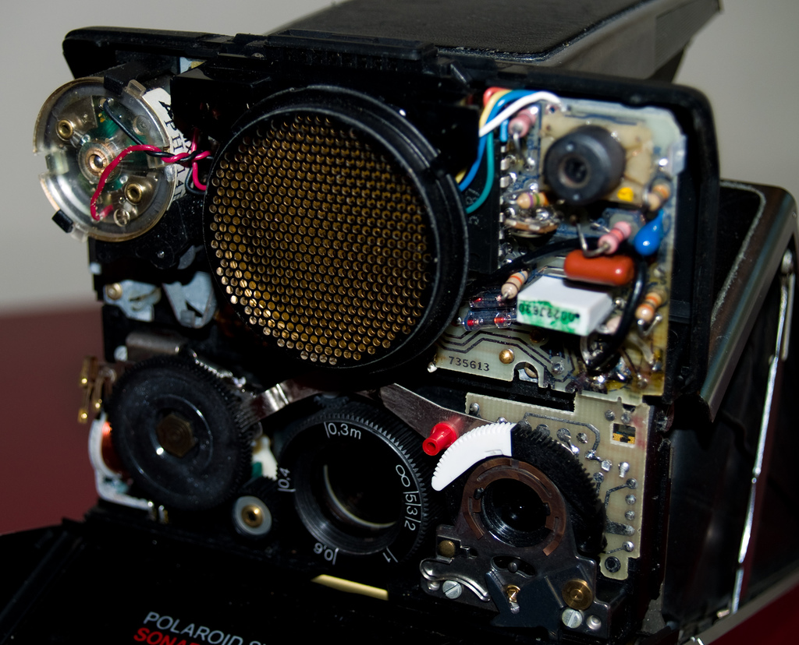

# Sonar

 

**A small, lightweight uptime app - pings an endpoint and saves data about response**

## About

This app was built around a very simple problem - I need to be able to check an endpoint routinely (say every 5 minutes) and see if the app is running and what the latency is. This should be very easy to do right? Well there are services that charge an arm and a leg for this task; but my app is a simple one - can't I just run it on my Macbook Pro? Here is the result of an hour or so of me putting this together.

### Attribution

The image used in this README, [Sonar Guts](https://flic.kr/p/48Uty1) by [Tim Williams](https://www.flickr.com/photos/timmythesuk/) is licensed under [CC BY-NC-SA 2.0](https://creativecommons.org/licenses/by-nc-sa/2.0/)
